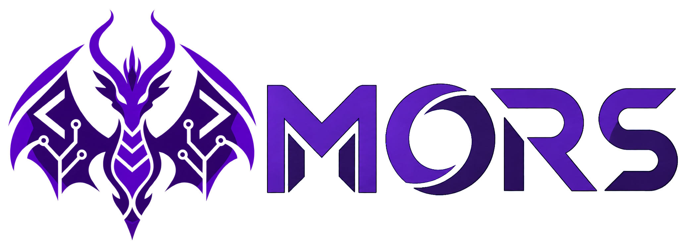

<div align="center">
  <p><strong>English (en-US)</strong> | <a href="README.zh-TW.md">繁體中文 (zh-TW)</a></p>

  

  A modern C++23 UCI chess engine.

  [![C++23][cpp-badge]][cpp-link]
  [![UCI][uci-badge]][uci-link]
  [![License][license-badge]][license-link]
  [![Last commit][commits-badge]][commits-link]
</div>

**MORS** is an independent, actively developed chess engine written in C++23 by [Theodore Magnus Øen & Codex](AUTHORS). It communicates through the [Universal Chess Interface][uci-link], so it can run in a terminal or inside a UCI-compatible chess GUI.

The current development version is **Dragon of MORS 0.2.0-dev**. MORS supports standard chess and Chess960, with persistent Lazy SMP search workers and a configurable 1–22,528 thread count (default: 1).

## Highlights

- Iterative-deepening Principal Variation Search with aspiration windows and persistent Lazy SMP workers sharing the transposition table.
- Incrementally updated P2-H32 neural evaluation.
- Clustered transposition table with a configurable 1–8,589,934,592 MiB (8 PiB) UCI Hash option.
- Check-aware quiescence search with TT probe/store, non-PV bound cutoffs, raw static-evaluation caching, SEE and late-move pruning; outside check it generates only noisy moves.
- Static Exchange Evaluation and TT, killer, countermove, butterfly, continuation and noisy-history move ordering. Worker-private histories persist across searches.
- Reverse and forward futility pruning, null-move pruning with verification, late-move pruning and reductions, internal iterative reduction, and singular extension with multi-cut handling.
- Legal move generation for standard chess and Chess960, make/unmake, Zobrist hashing, repetition detection, the fifty-move rule, and insufficient-material detection.
- An embedded, provenance-verified default network with optional external network loading through `EvalFile`.
- Fixed-ISA Windows builds for generic x86-64, AVX2, BMI2, and AVX2+BMI2.

## Neural Evaluation

MORS uses the **P2-H32** incrementally updated neural architecture:

| Component | Shape |
|---|---:|
| Feature mapping | `canonical-hmirror-v1` |
| Coarse branch | 10,240 → 768 |
| Fine branch | 22,528 → 256 |
| Output buckets | 64 |

The default network is [`mors-p2h32-s14400M-o3183M-c+frc.mnue`](networks/mors-p2h32-s14400M-o3183M-c+frc.mnue). It is embedded directly into release executables, so the engine does not require a separate network file at runtime.

Before compilation, the Makefile checks the network size and SHA-256 digest against [its provenance record](networks/mors-p2h32.provenance.toml). That record also preserves the architecture, training run, dataset fingerprint, and promotion-test metadata. The current network completed 200 superbatches over approximately 14.4 billion requested training positions.

An external compatible network can still be loaded at runtime:

```text
setoption name EvalFile value C:\path\to\network.mnue
```

Setting `EvalFile` back to the default filename restores the embedded network.

## Building

### Requirements

MORS currently has a Windows-oriented GNU Make build. The recommended environment is an **MSYS2 UCRT64 shell** with:

- a recent MinGW-w64 `g++` with C++23 support;
- GNU Make and Bash;
- `windres`;
- standard MSYS utilities including `sha256sum`, `sed`, `cut`, `tr`, and `wc`.

Clone the repository and enter it:

```bash
git clone git@github.com:TMagnusN/mors.git
cd mors
```

Build the recommended AVX2+BMI2 release:

```bash
make -C src -j$(nproc) CONFIG=release ARCH=avx2+bmi2
```

The engine will be written to:

```text
build/release-avx2+bmi2/mors-avx2+bmi2.exe
```

Release builds use `-O3`, LTO by default, section garbage collection, and static GCC/MinGW C++ runtimes. The default NNUE and Windows icon are embedded into the executable.

### Architecture variants

| `ARCH` | CPU requirement | Sliding attacks |
|---|---|---|
| `generic` | Baseline x86-64 | Magic bitboards |
| `avx2` | AVX2 | AVX2-capable path, non-PEXT attacks |
| `bmi2` | BMI2 | PEXT |
| `avx2+bmi2` | AVX2 and BMI2 | PEXT with AVX2 available |

Build every release variant:

```bash
make -C src -j$(nproc) all-versions
```

Disable LTO when needed with `LTO=0`. Debug and sanitizer configurations are also available through `CONFIG=debug` and `CONFIG=sanitize`.

## Testing

Run the complete debug test suite for the target architecture:

```bash
make -C src -j$(nproc) CONFIG=debug ARCH=avx2+bmi2 LTO=0 test-run
```

The suite covers attack generation, direct and reference legal move generation, perft positions, make/unmake and Zobrist restoration, SEE, transposition-table behavior, incremental neural evaluation, search invariants, qsearch TT storage/reuse, persistent worker histories, shared node limits, time management, UCI behavior, and BulletFormat datagen records.

Useful standalone targets include:

```bash
make -C src ARCH=avx2+bmi2 perft
make -C src ARCH=avx2+bmi2 ttbench
make -C src ARCH=avx2+bmi2 CONFIG=release datagen
```

The search-distillation generator is documented in [`tools/DATAGEN.md`](tools/DATAGEN.md).

## Using MORS

Start the engine directly:

```bash
./build/release-avx2+bmi2/mors-avx2+bmi2.exe
```

Minimal UCI session:

```text
uci
isready
position startpos
go movetime 1000
quit
```

MORS accepts standard six-field FEN and the common four- or five-field forms with omitted move counters. A `position fen ... moves ...` command is parsed up to the `moves` separator, matching normal UCI GUI behavior.

For Chess960, enable `UCI_Chess960` before sending the position. MORS accepts both X-FEN `KQkq` rights and Shredder-FEN rook-file letters, and uses the UCI Chess960 king-to-rook-square castling notation.

### UCI options

| Option | Range/default | Description |
|---|---|---|
| `Threads` | 1–22,528; default 1 | Persistent Lazy SMP workers with a shared TT and private search state; creation depends on available system resources. |
| `Hash` | 1–8,589,934,592 MiB (8 PiB); default 16 MiB | Transposition-table capacity; allocation depends on available memory and address space. |
| `NumaPolicy` | `auto` / `none`; default `auto` | Bind workers and replicate NNUE on used NUMA nodes when multiple nodes or processor groups are available; `none` uses OS scheduling and one shared network. |
| `Clear Hash` | Button | Clears all transposition-table entries. |
| `UCI_Chess960` | false | Enables Chess960 FEN and castling notation. |
| `EvalFile` | Embedded network by default | Loads a compatible external P2-H32 network. |
| `Move Overhead` | 0–5000 ms; default 10 ms | Reserves time for GUI, scheduling, and communication delay. |

`NumaPolicy=auto` uses physical cores before SMT siblings when binding is active.
Worker history is initialized after binding, and NNUE replicas use preferred-node
allocation. A single node/group retains OS scheduling; `none` disables binding
and replication. The shared TT still uses its existing allocator. For concurrent
engine processes, use separate external CPU affinities or `none`; automatic
placement does not reserve CPUs across processes. See [NUMA details](src/platform/README.md).

## Project Layout

| Path | Purpose |
|---|---|
| [`src/chess`](src/chess) | Board representation, attacks, legal move generation, make/unmake, Zobrist hashing, and perft. |
| [`src/search`](src/search) | PVS, quiescence, pruning, move ordering, time management, SEE, and the transposition table. |
| [`src/eval/nnue`](src/eval/nnue) | P2-H32 network loading and incremental evaluation. |
| [`tests`](tests) | Correctness and regression tests. |
| [`tools`](tools) and [`src/tools`](src/tools) | Magic generation, perft, TT benchmarks, and search-distillation datagen. |
| [`networks`](networks) | Embedded network artifact and reproducibility metadata. |
| [`resources/windows`](resources/windows) | Windows executable icon and resource script. |

## Development Status

MORS is experimental software under active development. Search techniques and neural networks are promoted only after correctness checks and controlled engine matches, but short-time-control results are not a universal rating and should not be treated as one.

The current scope intentionally excludes:

- Syzygy tablebases;
- opening-book play inside the engine.

These may be added later, but the README documents only functionality that exists in the current tree.

## Acknowledgements

MORS is independently implemented, but its development benefits from studying strong open-source engines and tooling:

- [Stockfish][stockfish-link], for public search-engineering, UCI, testing, and build ideas.
- [Reckless][reckless-link] and Weiawaga, as clean public comparison points for search and pruning design.
- [MagnusChessX][magnuschess-link], for the earlier training pipeline and network-development history.
- [bullet][bullet-link] and the BulletFormat ecosystem, for neural-network training and data tooling.
- [fastchess][fastchess-link] and UHO opening suites, for reproducible engine matches.

Acknowledgement does not imply that MORS copies source code from these projects. MORS keeps its own data structures, network format integration, search semantics, tests, and tuning decisions.

## License

MORS is distributed under the **GNU Affero General Public License v3.0 or later**. See [LICENSE](LICENSE).

[repo-link]: https://github.com/TMagnusN/mors
[commits-link]: https://github.com/TMagnusN/mors/commits/main
[license-link]: https://github.com/TMagnusN/mors/blob/main/LICENSE
[cpp-link]: https://en.cppreference.com/w/cpp/23
[uci-link]: https://www.shredderchess.com/chess-features/uci-universal-chess-interface.html
[stockfish-link]: https://github.com/official-stockfish/Stockfish
[reckless-link]: https://github.com/codedeliveryservice/Reckless
[magnuschess-link]: https://github.com/TMagnusN/MagnusChessX
[bullet-link]: https://github.com/jw1912/bullet
[fastchess-link]: https://github.com/Disservin/fastchess
[cpp-badge]: https://img.shields.io/badge/C%2B%2B-23-00599C?style=for-the-badge
[uci-badge]: https://img.shields.io/badge/Protocol-UCI-brightgreen?style=for-the-badge
[license-badge]: https://img.shields.io/badge/License-AGPL--3.0--or--later-success?style=for-the-badge
[commits-badge]: https://img.shields.io/github/last-commit/TMagnusN/mors/main?style=for-the-badge&label=last%20commit
